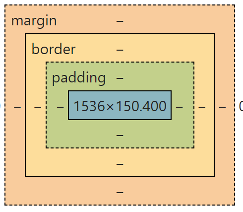

## 盒模型的概念

我们的网页是由一个一个的标签元素组成的，这些标签在CSS的体系中可以理解成一个一个的盒子，一个标签就是一个盒子，理解这些盒子的原理有助于我们更好的实现CSS的布局和排版。

## 盒模型的组成

- 内容区(content)
- 内边距(padding) 
- 边框(border) 
- 外边距(margin)

## 盒模型的计算

**总宽度= width + margin(左右) + padding(左右) + border(左右)**

**总高度= height+ margin(上下) + padding(上下) + border(上下)**