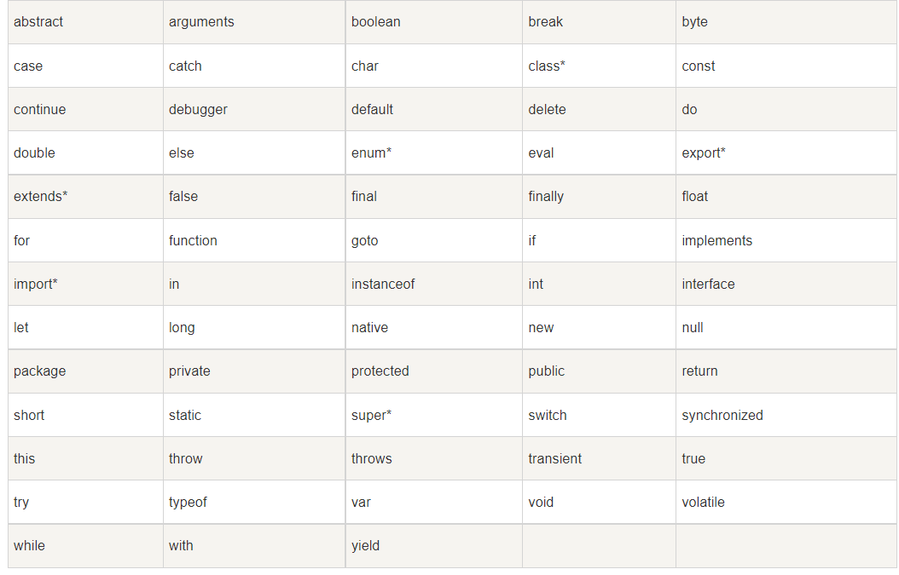
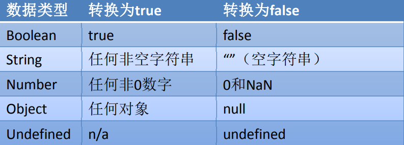

## 编写位置

我们目前学习的JS全都是客户端的JS，也就是说全都是需要在浏览器中运行的，所以我们我们的JS代码全都需要在网页中编写

- 在`head`中添加`script`，在`script`中编写js代码即可

  ```html light
  <!DOCTYPE html>
  <html lang="en">
    <head>
      <meta charset="UTF-8" />
      <meta http-equiv="X-UA-Compatible" content="IE=edge" />
      <meta name="viewport" content="width=device-width, initial-scale=1.0" />
      <title>Document</title>
      <script>
        alert('hello world!!!');
      </script>
    </head>
    <body></body>
  </html>
  ```

- 在`body`中添加`script`，在`script`中编写js代码即可

  ```html light
  <!DOCTYPE html>
  <html lang="en">
    <head>
      <meta charset="UTF-8" />
      <meta http-equiv="X-UA-Compatible" content="IE=edge" />
      <meta name="viewport" content="width=device-width, initial-scale=1.0" />
      <title>Document</title>
    </head>
    <body>
      <script>
        alert('hello world!!');
      </script>
    </body>
  </html>
  ```

- 在`body`结束后添加`script`，在`script`中编写js代码即可

  ```html light
  <!DOCTYPE html>
  <html lang="en">
    <head>
      <meta charset="UTF-8" />
      <meta http-equiv="X-UA-Compatible" content="IE=edge" />
      <meta name="viewport" content="width=device-width, initial-scale=1.0" />
      <title>Document</title>
    </head>
    <body></body>
    <script>
      alert('hello world!!');
    </script>
  </html>
  ```

- 在外部新建`js文件夹`，新建以`.js`为后缀名的js脚本，在网页中引入，引入位置与前三个书写位置一致

  ```js light
  <!DOCTYPE html>
  <html lang="en">
    <head>
      <meta charset="UTF-8" />
      <meta http-equiv="X-UA-Compatible" content="IE=edge" />
      <meta name="viewport" content="width=device-width, initial-scale=1.0" />
      <title>Document</title>
      <!-- 引入js -->
      <!-- <script src="./js/index.js"></script> -->
    </head>
    <body>
      <!-- <script src="./js/index.js"></script> -->
    </body>
    <script src="./js/index.js"></script>
  </html>
  
  // js/index.js
  alert('hello world')
  ```

- 注意：

  - 我们的JS代码需要编写到script标签中
  - 我们一般将script标签写到body下方
  - 当script标签有了src属性,就不要在标签中写js代码

- 属性：

  - type：默认值text/javascript可以不写，不写也是这个值
  - src：当需要引入一个外部的js文件时，使用该属性指向文件的地址


## Hello World

```js light
  <script>
    // 输出语句，在控制台输出hello world
    console.log('hello world');
    // 弹出语句，在页面加载时弹出 hello world
    alert('hello world');
  </script>
```

## 严格区分大小写 

- JavaScript是严格区分大小写的，也就是abc和Abc会被解析器 认为是两个不同的东西。

-  所以在编写上边的HelloWorld时，一定要注意区分大小写。

- 注释 

- 注释中的内容不会被解析器解析执行，但是会在源码中显示，我们一般会使用注释对程序中的内 容进行解释。

-  JS中的注释和Java的的一致，分为三种：
  - 单行注释（双斜杠）：// 注释内容 
  
  - 多行注释：/* */
  
  - 文档注释：/** 注释内容 */
  
    ```js light
    <!DOCTYPE html>
    <html lang="en">
      <head>
        <meta charset="UTF-8" />
        <meta http-equiv="X-UA-Compatible" content="IE=edge" />
        <meta name="viewport" content="width=device-width, initial-scale=1.0" />
        <title>Document</title>
      </head>
      <body></body>
      <script>
        // 单行注释 输出了 hello world
        console.log('hello wolrd');
    
        /* 
          多行注释
          多行注释
        */
    
        /**
         * 文档注释：一般用在方法、常量、类等上
         * 文档注释
         */
      </script>
    </html>
    ```

## 标识符

-  所谓标识符，就是指变量、函数、属性的名字，或函数的参数。
-  标识符可以是按照下列格式规则组合起来的一或多个字符： 
  - 第一个字符必须是一个字母、下划线（ _ ）或一个美元符号（ $ ）。 
  - 其他字符可以是字母、下划线、美元符号或数字。 
- 按照惯例，ECMAScript 标识符采用驼峰命名法。
- 但是要注意的是JavaScript中的标识符不能是关键字和保留字符



\* 标记的关键字是 ECMAScript5 中新添加的。

## 变量

-  变量的作用是给某一个值或对象标注名称。 
-  比如我们的程序中有一个值123，这个值我们是需要反复使用的，这个时候 我们最好将123这个值赋值给一个变量，然后通过变量去使用123这个值。 
-  变量的声明：
  - 使用var关键字声明一个变量
  - var a; 
-  变量的赋值
  -  使用=为变量赋值
  - a=123; 
-  声明和赋值同时进行：
  - var a = 123

```js light
 <script>
    // 1.声明变量
    var a;
    // 2.赋值 将 1 赋值给a
    a = 1;
    // 3.输出a的值(使用)
    console.log(a);

    // 1.声明变量并赋值
    var b = 'hello world';
    // 3.输出
    console.log(b);
  </script>
```

## 数据类型

- 数据类型决定了一个数据的特征，比如：123和”123”，直观上看这两个 数据都是123，但实际上前者是一个数字，而后者是一个字符串

- 对于不同的数据类型我们在进行操作时会有很大的不同。 

- 数据类型分为两类：`基本数据类型` 和 `引用数据类型`

- JavaScript中一共有5种基本数据类型： 
  - 字符串型（String） 

    ```js light
    <script>
        // 声明的字符串变量 需要是同单引号或者双引号包裹起来
        var a = "1";
        var b = "hello world";
        var c = "saeff";
    
        console.log(a, b, c);
      </script>
    ```

  - 数值型（Number）

    ```js light
    <script>
        // 声明了number(数值)类型的变量
        // 十进制（日常生活使用）
        var a = 100;
        // 十六进制 （颜色）
        var b = 0xff;
        // 八进制
        var c = 0o100;
        // 二进制 计算机 0 1
        var d = 0b100;
        // 输出10 进制
        console.log(a, b, c, d);
      </script>
    ```

  - 布尔型（Boolean）

    ```js light
    <script>
        // boolean 类型的值 true真  false假
        var isHot = true;
        var isCold = false;
    
        console.log(isHot, isCold);
      </script>
    ```

  - null型（Null） 

    ```js light
    <script>
        // null 空值
        var a = null;
    
        console.log(a);
      </script>
    ```

  - undefined型（Undefined） 

    ```js light
     <script>
        // undefined 未定义
        // 1.没有赋值的变量，结果就是undefined
        var a;
        // 2.赋值为undefined的变量，结果就是undefined
        var b = undefined;
    
        console.log(a, b);
      </script>
    ```

- 除了这5种基本数据类型，其余的都是`引用数据类型`

- 这5种之外的类型都称为Object，所以总的来看JavaScript中共有六种数据类型

## typeof运算符 

- 使用typeof操作符可以用来检查一个变量的数据类型

- 使用方式：typeof 数据，例如 typeof 123

- 返回结果： 
  - typeof 数值 "number "
  - typeof 字符串 "string "
  - typeof 布尔型 "boolean"
  - typeof undefined "undefined"
  - typeof null "object"

  ```js light
  <script>
      var a = 1; // number
      console.log(typeof a);
  
      var b = "hello world"; // string
      console.log(typeof b);
  
      var c = true; // boolean
      console.log(typeof c);
  
      var d = undefined; // undefined
      console.log(typeof d);
  
      var e = null; // object 测不出来
      console.log(typeof e);
    </script>
  ```

  

## String 

- String用于表示一个字符序列，即字符串

- 字符串需要使用 ''或"" 括起来

- 将其他数值转换为字符串有三种方式：toString()、String()、 拼串

  ```js light
   <script>
      var a = 123; // number
      // 1.toString() 将a转化为字符串类型并且赋值给b
      var b = a.toString();
  
      console.log(typeof b); // string
  
      // 2.通过String()
      var c = String(a);
      console.log(typeof c); // string
  
      // 3.拼串
      var d = a + "";
      console.log(typeof d); // string
    </script>
  ```

## Number 

- Number 类型用来表示整数和浮点数，最常用的功能就是用来 表示10进制的整数和浮点数

- Number表示的数字大小是有限的，范围是： – ± 1.7976931348623157e+308 – 如果超过了这个范围，则会返回± Infinity

- NaN，即非数值（Not a Number）是一个特殊的数值，JS中当对数值进行计算时没有结果返回，则返回NaN

  ```js light
  <script>
      var a = 100.85;
  
      console.log(typeof a); // number
  
      // 当数字的大小超过界限 返回 Infinity结果
      console.log(a * a * a * a);
  
      console.log(a * "hello world"); // NaN 不是一个数字 
    </script>
  ```

## 数值的转换 

- 有三个函数可以把非数值转换为数值：Number()、parseInt()和parseFloat()

- Number()可以用来转换任意类型的数据，而后两者只能用于转换字符串

- parseInt()只会将字符串转换为整数，而parseFloat()可以转换为浮点数

  ```js light
   <script>
      // 1.Number
      var a = Number(true); // 1
      var b = Number(false); // 0
      var c = Number(null); // 0
      var d = Number(undefined); // NaN
      var e = Number("a"); // NaN
  
      console.log(a, b, c, d, e);
  
      // 2.parseInt 去除小数部分
      var f = parseInt(123.45); // 123
      var j = parseInt("123.45"); // 123
      console.log(f, j);
  
      // 3.parseFloat 转化小数
      var g = parseFloat("123.45"); // 123.45
      console.log(g);
    </script>
  ```

## Boolean(布尔型) 

布尔型也被称为逻辑值类型或者真假值类型

布尔型只能够取真（true）和假（false）两种数值。除此以外， 其他的值都不被支持

其他的数据类型也可以通过Boolean()函数转换为布尔类型

 转换规则:



## Undefined

- Undefined类型只有一个值，即特殊的undefined
- 在使用 var 声明变量但未对其加以初始化时，这个变量的值就是undefined。例如： 
  - var message; 
  - message的值就是undefined。
- 需要注意的是typeof对没有初始化和没有声明的变量都会返回 undefined

## Null

-  Null类型是第二个只有一个值的数据类型，这个特殊的值是null 
- 从语义上看null表示的是一个空的对象。所以使用typeof检查 null会返回一个Object
- undefined值实际上是由null值衍生出来的，所以如果比较undefined和null是否相等，会返回true
