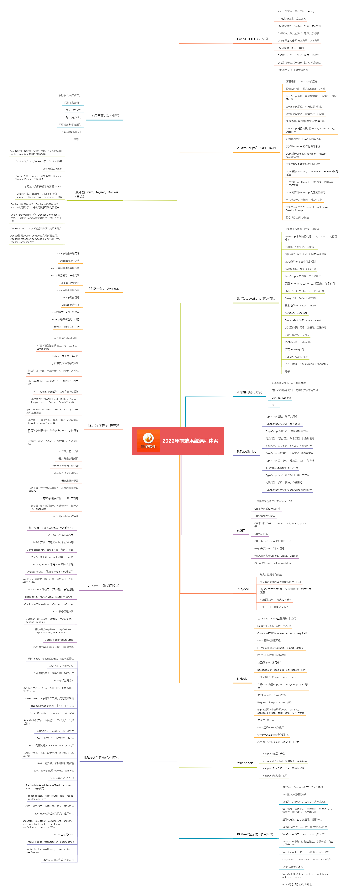

## 软件开发是什么

软件开发是根据用户要求建造出软件系统或者系统中的软件部分的过程。

软件开发是一项包括需求捕捉、需求分析、设计、实现和测试的系统工程。

软件一般是用某种程序设计语言来实现的。通常采用软件开发工具可以进行开发。软件分为系统软件和应用软件，并不只是包括可以在计算机上运行的程序，与这些程序相关的文件一般也被认为是软件的一部分。

软件设计思路和方法的过程，包括设计软件的功能和实现的算法和方法、软件的总体结构设计和模块设计、编程和调试、程序联调和测试,然后进行编写再提交程序。

## 前端是什么

前端开发是从网页制作演变而来
早期的网页制作主要内容都是静态的，以文字图片为主，用户使用网站也以浏览为主

随着互联网的发展，现代网页更佳美观，交互效果显著，功能更加强大
因此现在的前端开发的主要技术通常是指 html、css、js 技术和一些开发框架的使用

## 前端需要学习什么

网页布局：HTML+CSS+HTML5+CSSS3

网页交互：JavaScript 初级+JavaScript 高级 =>ES5

前端工程化：ES6+Typescript+webpack+Vue2.0+React+Vue3.0+Less+Scss

网络请求：Ajax+Axios

跨平台开发：微信小程序+UNIAPP

后端：nodejs+Express+KOA

数据库：MySQL

版本管理软件:Git

...

## 学习方法

第一：梳理信心，坚定目标。只要相信自己可以就一定可以

第二：学习就是重复，多练习多写，好的代码是写出来不是看出来的，养成用写代码的方式对课件的理解，而非盯着课件看的方式理解代码

第三：不要停止学习，互联网的发展特别快，可能快过其他任何领域，因此不要有一次学习就可以工作终身的想法

第四：开放的心态，去拥抱变化，不断尝新，并且停止争论语言和工具，把精力投放在更合适的领域
